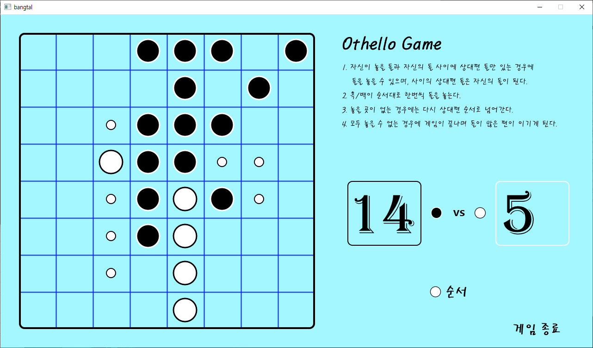
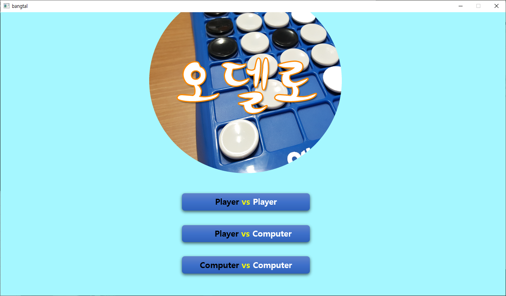

C++ 방탈 라이브러리로 개발되었으며,
동일한 소스 코드로 Windows (Visual Studio) / Android (Android Studio) / MacBook (Xcode) 프로젝트를 구성한다.
Python 프로젝트도 포함되어 있다.

## 오델로 게임

[오델로](https://ko.wikipedia.org/wiki/오델로)는 가로 세로 8칸의 보드에
검은 돌과 흰돌을 번갈아 놓는 보드 게임이다.
돌은 반드시 상대방 돌을 양쪽으로 포위하여 뒤집을 수 있는 곳에만 놓을 수 있다.

간단한 컴퓨터 플레이어도 구현되어 있어서 사람 vs. 컴퓨터 또는 컴퓨터 vs 컴퓨터도 게임을 즐길 수 있다.

